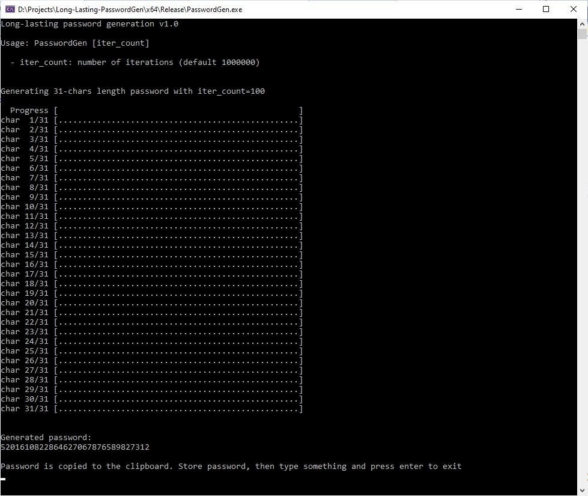

# Long-Lasting-PasswordGen
long-lasting password generation console app (currently for Windows os).

## What for
Program generates some string of digits that can be used as a password for apps that help in self-control productivity and managing time waste on computer (like ColdTurkey or DNS CleanBrowsing).

Generating a password intentionally takes a long time (for example a whole day or more). 
You can control this time by specify parameter to application (clamped to range: 10,000 - 10,000,000). You can try different values on your computer and check how long it takes (progress is updated during generation process).

The code is also intentionally written in such a way that it is difficult to rewrite it into code that runs faster.

## Building from sources
Program uses C++ 17 (with some small changes it can be compiled in older standards) and is a single file cpp. Project solution is for Visual Studio 2022. WinAPI is used only for copying generated string to clipboard.

## Download the latest build
The latest, ready to use build is in folder 'exe'. 
